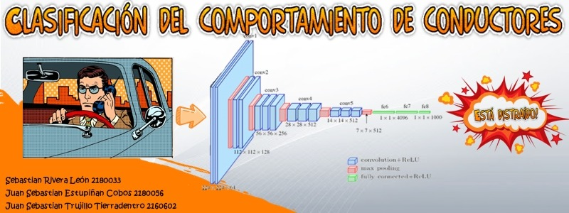

# Clasificación del comportamiento de conductores

Un conductor está expuesto a muchas distracciones, las cuales pueden llevar a accidentes en la carretera. Estas distracciones pueden ser identificadas por medio de las acciones del conductor, como hablar por celular o ver hacia otros lados. En este proyecto se desarrolla una red convolucional que identifique el comportamiento del conductor respecto a si se encuentra distraído o no por medio de la captura de imágenes del mismo. Los resultados de la clasificación obtenida presentaron buenas métricas, alcanzando un 98% de clasificación para las imágenes de prueba, por otro lado, la aplicación a video presentó resultados coherentes.
